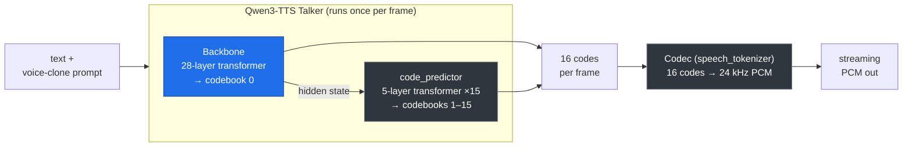

# Voice Agent (Qwen3-TTS + Pipecat + React)

A local voice agent: talk into your browser, an AI replies out loud. Same idea as
Vapi or Retell, running entirely on your own machine.

```
Browser (mic + speaker)  →  Pipecat server  →  Inference server (Qwen3-TTS)
     :5173                       :7860                  :8000
                                   │
                                   ├─ Deepgram  (speech → text)
                                   └─ OpenAI    (text → reply)
```

The browser only ever talks to the Pipecat server (:7860). The Pipecat server is
the only thing that knows about Deepgram, OpenAI, and the inference server.

## What's in here

```
voice-agent/
  inference_server/    Loads Qwen3-TTS, turns text into streaming audio (port 8000)
    app.py             FastAPI WebSocket server
    engine.py          Streaming TTS engine + the megakernel integration
    common.py          Qwen3-TTS loader (also moves the codec to the GPU)
    metrics.py         Latency / RTF reporting
    debug_tools/       Benchmarks + profiling/diagnostic scripts (not needed to run)
  pipecat_server/      The voice pipeline the browser connects to (port 7860)
    server.py          Process entrypoint (loads .env, starts the runner)
    voice_agent.py     The pipeline: mic → Deepgram → OpenAI → Qwen TTS → speaker
    qwen_ws_tts.py     Pipecat TTS service that calls the inference server
    requirements.txt   Minimal deps to run ONLY the pipecat server (laptop)
  frontend/            React web app (port 5173), with the V1/V2 streaming toggle
  megakernel/          The CUDA megakernel + its Qwen3-TTS port, docs, parity checks
    qwen_tts_megakernel/   csrc/ (kernel.cu) + package + checks/
    docs/              Roadmap, Vast.ai setup, perf results, demo guide
  requirements.txt     All Python deps (covers the box: model + kernel + pipecat)
  setup.sh             One-shot box setup (verify GPU + install + parity checks)
  .env.example         Copy to .env and add your API keys
```

---

# How Qwen3-TTS works (and what the megakernel replaces)

Qwen3-TTS turns text into speech in three stages. Each output frame is **16
stacked integer codes** (codebook-0 plus codebooks 1–15) that the codec turns
into 80 ms of 24 kHz audio. Per frame:



- **Blue = replaced by the megakernel** — the 28-layer talker **backbone**
  (codebook-0). One fused CUDA kernel does all 28 layers in **~1 ms/step**.
- **Grey = still PyTorch** — the **code_predictor** (a separate 5-layer model run
  15× per frame) and the **codec**. These are *not* in the backbone kernel's
  scope; the code_predictor is the dominant per-frame cost (see benchmarks).

---

# The megakernel: how it speeds up Qwen3-TTS

### First, what's a "megakernel"?

When a model runs normally in PyTorch, each layer is a separate GPU operation
("kernel"). A 28-layer transformer launches *hundreds* of tiny GPU operations per
step, and the GPU spends a lot of time waiting between them (launch overhead, and
reading/writing memory over and over).

A **megakernel** fuses the *entire* transformer into **one** giant GPU program.
The whole 28-layer forward pass runs in a single launch, keeping data in fast
on-chip memory instead of bouncing to slow global memory between layers. The
result: the talker **backbone** runs in **~1 millisecond per step** instead of
~40+ ms in PyTorch.

We started from AlpinDale's [`qwen_megakernel`](https://github.com/AlpinDale/qwen_megakernel)
(a megakernel for the **text** model, Qwen3-0.6B) and **ported it to the Qwen3-TTS
talker backbone**. We could reuse most of it because the talker backbone is the
same *shape* as Qwen3-0.6B (28 layers, 1024 hidden dim, 8 key/value heads,
head-dim 128). Only a handful of things are different for the TTS model — those
are the changes below.

### What we changed to make it work for Qwen3-TTS

Each row is "the text model did X, but the TTS talker needs Y, so we changed Z."
Don't worry if some terms are unfamiliar — the **Why** column explains what would
break if we *didn't* make the change.

| What | Text model (Qwen3-0.6B) | TTS talker | Why it matters (plain terms) |
|------|-------------------------|------------|------------------------------|
| **RoPE theta** (how the model encodes word *position*) | `10,000` | **`1,000,000`** | "RoPE" is how the model knows the order of tokens. The TTS talker was trained with a different base number (1,000,000). If you leave it at the text value, the model thinks every position is wrong and produces garbage. We set the right value in both the Python code and the kernel's lookup tables. |
| **Output vocabulary size** (how many possible outputs) | `151,936` words | **`3,072`** codes | The text model picks from ~152k words; the TTS talker picks from only 3,072 audio "codes". The kernel had the word-count hard-coded. With the wrong (bigger) number it reads past the end of the weights array → instant GPU crash. We made it a build flag: `-DLDG_VOCAB_SIZE=3072`. |
| **Separate input/output tables** | input & output share one table | **two separate tables** | The text model uses one table both to read tokens in and write predictions out ("tied"). The TTS talker uses two different tables (`codec_embedding` in, `codec_head` out — "untied"). We hand the kernel both. |
| **Input is a vector, not a token number** | layer 0 looks up `embedding[token_id]` | **a ready-made vector** | The text kernel starts from a token *number* and looks up its vector. But the TTS talker hands the backbone an already-computed vector (a sum of the previous codes' embeddings). We added a new GPU op, **`decode_from_hidden`**, that lets the kernel start from a vector directly. We verified it gives bit-for-bit identical results to the original path. |
| **MRoPE** (3-part position scheme) | plain 1D positions | collapses to 1D | The TTS model has a fancier 3-part position scheme ("MRoPE"). We checked, and on the step-by-step decode path all 3 parts are identical — so plain positions are exactly correct and no kernel rewrite was needed. |

### Two performance bugs we found by measuring (not guessing)

When we first plugged the kernel into the server, audio generation *looked* like
it was hanging. Instead of guessing, we profiled it. The diagnostic scripts that
found these live in `inference_server/debug_tools/`.

**Bug 1 — the codec was secretly running on the CPU (≈450× slower).**

The "codec" is the part that turns audio codes into actual sound. We thought it
was on the GPU, but it was running on the CPU the whole time — taking **~13
seconds per call** while the GPU sat idle. (We proved it with PyTorch's profiler:
13.7 s of wall-clock time, but ~0 ms of *GPU* time — almost all of it was data
being copied back and forth between CPU and GPU.)

Why did this happen? In PyTorch you move a model to the GPU with
`model.to("cuda")`. But the codec (`speech_tokenizer`) is a **wrapper object** —
its actual neural network is tucked inside `.model`, and the top-level
`model.to("cuda")` **doesn't reach into it**. So it silently stayed on the CPU.

**The fix** (in `common.load_model()`): explicitly move the codec's inner network
to the GPU — `speech_tokenizer.model.to("cuda")` — and update the wrapper's
device flag. Codec time dropped from **~13,000 ms → ~28 ms** per call.

**Bug 2 — the backbone was being computed twice every step.**

Our first attempt ran the kernel as a "hook" — code that runs *after* a function
finishes. But a hook fires **after** PyTorch has *already* run all 28 backbone
layers (~42 ms). So every step did the slow PyTorch backbone, then ran the fast
kernel and **threw the PyTorch result away.** We were paying for both and keeping
only one — wasting the kernel's whole advantage.

**The fix:** make the kernel **replace** the backbone's forward pass instead of
running after it, so the slow PyTorch version never runs on decode steps. (One
subtlety: PyTorch tracks how many tokens it has seen via its "KV cache"; since we
skip its layers, we nudge that counter forward by one each step so the rest of
the model still keeps its place. The kernel keeps its own KV cache for the real
work.) Result: **~18% faster end-to-end.**

**Bonus — faster first word.** The codec normally waits for 4 frames before
emitting any sound. We made it emit after the *first* frame (`first_hop=1`), so
you hear the voice start much sooner. Time-to-first-chunk dropped ~2.7× (837 ms →
312 ms) with no change to overall speed.

### How we know the kernel is correct (not just fast)

A fast kernel that produces wrong audio is useless, so we verified it at every
step:
- **Single layer** matches PyTorch to within tiny rounding (max difference 0.0078).
- **Codebook-0** output is exactly identical.
- A full **16-code frame** matches 13/16 codes (the first 12 exact; the last few
  drift only by tiny `bfloat16` rounding — and an **ear test** confirmed this
  drift is **inaudible**).
- An **in-server check** confirmed the first 9 frames are bit-for-bit identical to
  plain PyTorch, then the same inaudible rounding drift.

Details in `megakernel/README.md` and `megakernel/docs/`.

## Benchmarks

Measured on an **RTX 5090** (Vast.ai), warmed, on a ~6 s utterance, via
`inference_server/debug_tools/bench_engine.py`. RTF = wall time ÷ audio duration
(lower is better; <1 = faster than real time). TTFC = time to first audio chunk.

> **Reproduce these on your own box.** From the repo root on the GPU machine
> (after `bash setup.sh`):
> ```bash
> cd inference_server
> # kernel backbone:
> PYTHONPATH=../megakernel/qwen_tts_megakernel QWEN_DEVICE=cuda LDG_VOCAB_SIZE=3072 \
> USE_KERNEL=1 python debug_tools/bench_engine.py
> # PyTorch baseline (drop the kernel): run again with USE_KERNEL=0
> QWEN_DEVICE=cuda USE_KERNEL=0 python debug_tools/bench_engine.py
> ```
> It warms up, runs one utterance, and prints TTFC / RTF / chunk gaps. Run both
> ways to reproduce the kernel-vs-PyTorch comparison. For per-frame breakdowns and
> the bug-hunting probes (codec-on-CPU, double-compute, etc.), see the other
> scripts and the guide in `inference_server/debug_tools/README.md`.

**Kernel backbone vs PyTorch backbone (full streaming server):**

| Metric              | PyTorch backbone | **Kernel backbone** | Improvement |
|---------------------|------------------|---------------------|-------------|
| TTFC                | 1031 ms          | **837 ms**          | ~19 % |
| RTF (overall)       | 2.963            | **2.441**           | ~18 % |
| RTF (steady-state)  | 2.949            | **2.431**           | ~18 % |
| Wall time (~6 s audio) | 17.54 s       | **14.84 s**         | 2.7 s saved |
| Chunk gap (mean)    | 917 ms           | **778 ms**          | ~139 ms |
| Streaming           | yes (19 chunks)  | yes (19 chunks)     | — |

**With the `first_hop=1` time-to-first-chunk optimization (kernel):**

| Metric           | kernel (hop=4) | **kernel (first_hop=1)** |
|------------------|----------------|--------------------------|
| TTFC             | 837 ms         | **312 ms** |
| First chunk gap  | ~745 ms        | **220 ms** |
| RTF (steady)     | 2.431          | 2.353 |

**Per-frame cost breakdown (kernel path):**

| Component | per frame | share |
|-----------|-----------|-------|
| code_predictor (codes 1–15, 5-layer ×15) | ~173 ms | **~76 %** ← bottleneck, plain PyTorch, out of kernel scope |
| backbone — kernel (`decode_from_hidden`) | **1.08 ms** | <1 % |
| codec decode (every 4th frame) | ~12 ms avg | ~6 % |

**Honest conclusion:** the megakernel does its job — the backbone is ~1 ms/step
(matching the 0.78 ms offline benchmark; ~1286 steps/s, ~103× real time) and the
whole pipeline is ~18 % faster with it on. The real-time targets (RTF<0.15) are
**not** met because the **code_predictor is ~76 % of every frame** and is outside
the backbone kernel's scope. The clear next step to approach real time is a
megakernel for the code_predictor, not the backbone.

> **Where the next big win is:** the **majority** of any further Qwen3-TTS speedup
> has to come from the **code_predictor** (~76 % of each frame), which the current
> megakernel does **not** cover. Writing a megakernel for the code_predictor is
> our planned next step — that's where the real-time gains are.

---

# Setup

Each component can be set up and run **independently**. Pick the section(s) you
need. For a full local demo you run all three (frontend + pipecat on your laptop,
inference server wherever the GPU is).

Prerequisites overall:
- **Python 3.11+** (3.14 used here), **Node.js 20+** for the frontend.
- **Deepgram** + **OpenAI** API keys (paid cloud) — only for the pipecat server.
- An **RTX 5090** (Blackwell, sm_120) for the megakernel path; any CUDA GPU (or
  CPU/MPS) works for the plain-PyTorch inference server.

## A. Inference server (Qwen3-TTS, port 8000) — on a GPU box / Vast.ai

This is the only piece that needs the model and (for the kernel) the GPU. It has
no dependency on the pipecat server or frontend.

**Box requirements:** RTX 5090, a CUDA **-devel** image with **nvcc ≥ 12.8**
(needed to JIT-compile the kernel), and the box's pre-installed CUDA build of
torch. **Do not use `uv run`** here — it builds a CPU-only torch env and the
kernel won't load.

**1. Clone + one-shot setup** (verifies the GPU, installs deps in the safe order,
runs the kernel parity checks):
```bash
git clone https://github.com/ckmonish2000/qwen-tts-0.6b-megakernel.git
cd qwen-tts-0.6b-megakernel
bash setup.sh
```

**2. Start the server with the megakernel:**
```bash
cd inference_server
PYTHONPATH=$(pwd)/../megakernel/qwen_tts_megakernel \
QWEN_DEVICE=cuda LDG_VOCAB_SIZE=3072 USE_KERNEL=1 \
python -m uvicorn app:app --host 0.0.0.0 --port 8000
```
Wait for `[server] ready.` and the line `[engine] USE_KERNEL=1 — megakernel
backbone active`. (First run downloads the model from HuggingFace.)

**Flags:**

| Flag | Meaning |
|------|---------|
| `USE_KERNEL=1` | Use the megakernel backbone. `0` (and drop `PYTHONPATH`) = plain PyTorch baseline. |
| `LDG_VOCAB_SIZE=3072` | Kernel LM-head size for the talker codec head (required with `USE_KERNEL=1`). |
| `PYTHONPATH=.../megakernel/qwen_tts_megakernel` | Lets the engine import the kernel package. |
| `QWEN_DEVICE=cuda` | Device (`cuda`/`mps`/`cpu`). bf16 on cuda (kernel requires it). |
| `--host 0.0.0.0` | Listen on all interfaces so an SSH tunnel can reach it. |

**3. Reach it from your laptop (Vast.ai):** open an SSH tunnel, then point clients
at `localhost:8000`:
```bash
# on your laptop:
ssh -p <BOX_PORT> root@<BOX_IP> -L 8000:localhost:8000
curl http://localhost:8000/health      # -> {"status":"ok","sample_rate":24000}
```

**Without a GPU / for local dev:** install the root `requirements.txt` and run
`QWEN_DEVICE=cpu python -m uvicorn app:app --port 8000` (or `mps` on Apple
Silicon, `USE_KERNEL` unset) — slow, but no kernel/GPU needed.

**Benchmark / verify** (on the box):
```bash
cd inference_server
PYTHONPATH=../megakernel/qwen_tts_megakernel QWEN_DEVICE=cuda LDG_VOCAB_SIZE=3072 \
USE_KERNEL=1 python debug_tools/bench_engine.py     # set USE_KERNEL=0 to compare
```

## B. Pipecat server (the voice pipeline, port 7860) — on your laptop

Needs **no GPU and no model** — just the two API keys and a WebSocket to the
inference server.

```bash
cd voice-agent
python -m venv .venv && source .venv/bin/activate
pip install -r pipecat_server/requirements.txt

cp .env.example .env        # then set DEEPGRAM_API_KEY and OPENAI_API_KEY

# point it at the inference server (local, or a tunneled box on :8000):
QWEN_TTS_URI=ws://localhost:8000/tts \
python pipecat_server/server.py -t webrtc
```

**Flags / env:**

| Env | Meaning |
|-----|---------|
| `QWEN_TTS_URI` | WebSocket URL of the inference server (default `ws://localhost:8000/tts`). |
| `QWEN_TTS_PREROLL` | Buffered-mode cushion in seconds (default 8). The UI toggles V1 buffered ↔ V2 realtime live; this sets the V1 cushion size. |

It also serves a built-in test UI at http://localhost:7860/client (no React app
needed), though that one has no V1/V2 toggle.

## C. Frontend (React web app, port 5173) — on your laptop

Talks **only** to the pipecat server (`http://localhost:7860`). Needs the pipecat
server running.

```bash
cd voice-agent/frontend
npm install
npm run dev          # opens http://localhost:5173
```

In the app: **Connect**, allow mic, hold **Speak** (or spacebar) to talk. The
**Mode** button toggles **V1 Buffered** (smooth, plays after the reply is ready)
↔ **V2 Realtime** (each chunk plays as it arrives; may stutter at RTF>1).

---

## Running the full demo (all three)

1. **Inference server** on the GPU box (section A), tunneled to your laptop `:8000`.
2. **Pipecat server** on your laptop (section B), `QWEN_TTS_URI=ws://localhost:8000/tts`.
3. **Frontend** on your laptop (section C) → open http://localhost:5173.

See `megakernel/docs/2026-06-09-demo-run-guide.md` for the annotated walkthrough.

## Notes

- **Replies are not instant** (RTF ~2.4 on the 5090 — the code_predictor/codec are
  slower than real time). Replies are kept to one short sentence; V1 buffered mode
  plays them smoothly, V2 realtime streams them (and may stutter). This is the
  honest behavior, not a bug — see the benchmarks above.
- **Use headphones** so the bot's own audio doesn't trigger the mic.
- After restarting the pipecat server, open a **fresh browser tab** before
  reconnecting, or you may see "Peer connection not found".

## Docs

- `megakernel/README.md` — the full kernel port: parity results, ear test, design.
- `megakernel/docs/2026-06-09-performance-results.md` — measured numbers + bug log.
- `megakernel/docs/2026-06-09-demo-run-guide.md` — annotated full-demo walkthrough.
- `megakernel/docs/2026-06-06-megakernel-vast-setup.md` — Vast.ai box runbook.
- `inference_server/debug_tools/README.md` — the benchmarking/profiling scripts.
- `docs/` — original design doc + bring-up debugging log.
