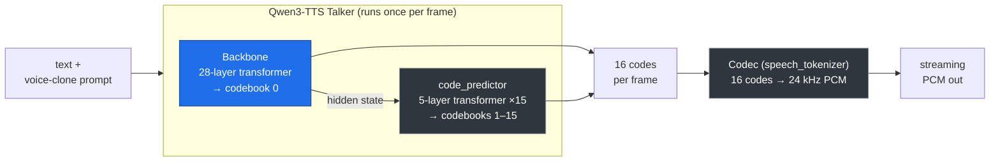

# Voice Agent (Qwen3-TTS + Pipecat + React)

A local voice agent: talk into your browser, an AI replies out loud. Same idea as
Vapi or Retell, running entirely on your own machine.

```
Browser (mic + speaker)  →  Pipecat server  →  Inference server (Qwen3-TTS)
     :5173                       :7860                  :8000
                                   │
                                   ├─ Deepgram  (speech → text)
                                   └─ OpenAI    (text → reply)
```

The browser only ever talks to the Pipecat server (:7860). The Pipecat server is
the only thing that knows about Deepgram, OpenAI, and the inference server.

## What's in here

```
voice-agent/
  inference_server/    Loads Qwen3-TTS, turns text into streaming audio (port 8000)
    app.py             FastAPI WebSocket server
    engine.py          Streaming TTS engine + the megakernel integration
    common.py          Qwen3-TTS loader (also moves the codec to the GPU)
    metrics.py         Latency / RTF reporting
    debug_tools/       Benchmarks + profiling/diagnostic scripts (not needed to run)
  pipecat_server/      The voice pipeline the browser connects to (port 7860)
    server.py          Process entrypoint (loads .env, starts the runner)
    voice_agent.py     The pipeline: mic → Deepgram → OpenAI → Qwen TTS → speaker
    qwen_ws_tts.py     Pipecat TTS service that calls the inference server
    requirements.txt   Minimal deps to run ONLY the pipecat server (laptop)
  frontend/            React web app (port 5173), with the V1/V2 streaming toggle
  megakernel/          The CUDA megakernel + its Qwen3-TTS port, docs, parity checks
    qwen_tts_megakernel/   csrc/ (kernel.cu) + package + checks/
    docs/              Roadmap, Vast.ai setup, perf results, demo guide
  requirements.txt     All Python deps (covers the box: model + kernel + pipecat)
  setup.sh             One-shot box setup (verify GPU + install + parity checks)
  .env.example         Copy to .env and add your API keys
```

---

# How Qwen3-TTS works (and what the megakernel replaces)

Qwen3-TTS turns text into speech in three stages. Each output frame is **16
stacked integer codes** (codebook-0 plus codebooks 1–15) that the codec turns
into 80 ms of 24 kHz audio. Per frame:



- **Blue = replaced by the megakernel** — the 28-layer talker **backbone**
  (codebook-0). One fused CUDA kernel does all 28 layers in **~1 ms/step**.
- **Grey = still PyTorch** — the **code_predictor** (a separate 5-layer model run
  15× per frame) and the **codec**. These are *not* in the backbone kernel's
  scope; the code_predictor is the dominant per-frame cost (see benchmarks).

---

# The megakernel: how it speeds up Qwen3-TTS

The kernel is AlpinDale's `qwen_megakernel` (a single fused CUDA kernel that runs
the Qwen3-0.6B transformer) **ported to the Qwen3-TTS talker backbone**. The
backbone has the same shape as Qwen3-0.6B (28 layers / 1024 dim / 8 KV heads /
head-dim 128 / RMSNorm eps 1e-6), so the per-step machinery is reused; only a few
things differ for the talker.

### Changes made to port the kernel to the talker

| Change | Text Qwen3-0.6B | Qwen3-TTS talker | Why |
|--------|-----------------|------------------|-----|
| **RoPE theta** | `10_000` | **`1_000_000`** | The talker backbone uses a 1e6 rotary base; using the text 1e4 gives wrong positions. Set in `model_tts.py` (`ROPE_THETA`) and the kernel's cos/sin tables. |
| **Output vocab** | `151936` | **`3072`** | The talker's LM head is `codec_head` (codebook-0, 3072 entries), not the text vocab. The kernel's LM-head size is a build flag `-DLDG_VOCAB_SIZE=3072`; using 151936 reads out of bounds (illegal memory access). |
| **Untied I/O head** | embed tied to LM head | **untied** | Talker input embed = `talker.model.codec_embedding`; output head = `talker.codec_head` — two *separate* tensors. The kernel was given both. |
| **Input is a hidden vector, not a token id** | layer-0 reads `embed[token_id]` | **`decode_from_hidden`** | The talker feeds the backbone a *summed code-embedding* (a hidden vector), not a token id. A new CUDA op `decode_from_hidden` makes layer 0 read a hidden vector directly (bit-identical to the token path). |
| **MRoPE** | 1D RoPE | collapses to 1D | The talker's 3-section MRoPE positions are identical on the decode path, so plain 1D RoPE is exact — no kernel rewrite needed (verified). |

### Two performance bugs found and fixed in the server integration

These were found by profiling, not guessing (the diagnostic scripts live in
`inference_server/debug_tools/`):

1. **The codec was running on the CPU.** `model.to("cuda")` does **not** move the
   `speech_tokenizer` (the codec) — it's a `Qwen3TTSTokenizer` *wrapper* whose
   real network lives in `.model`, which the top-level `.to()` never reaches. Left
   on the CPU, the codec decode took **~13 s/call** with the GPU doing ~0 ms of
   work (proven with `torch.profiler`: 13.7 s wall, ~0 ms CUDA, dominated by
   CPU↔GPU copies). This *looked* like a streaming hang. **Fix:** in
   `common.load_model()`, explicitly `speech_tokenizer.model.to("cuda")` and sync
   the wrapper's `.device`. Codec decode: **~13000 ms → ~28 ms (≈450×).**

2. **The backbone was computed twice per step.** The kernel first ran as a forward
   *hook*, which fires **after** PyTorch already ran all 28 layers (~42 ms/step) —
   so PyTorch's backbone ran every step and was thrown away, wasting the kernel's
   speed. **Fix:** the kernel now **replaces** `talker.model.forward` on decode
   steps (PyTorch handles prefill and seeds the kernel's KV cache; the PyTorch KV
   cache length is advanced with a dummy token/layer so HF's position bookkeeping
   stays correct; the kernel uses its own KV cache). **≈18 % faster end-to-end.**

A `first_hop=1` setting also emits the first audio chunk after 1 frame instead of
4, cutting time-to-first-chunk (TTFC) ~2.7× with no change to steady-state speed.

### Correctness

The ported kernel is verified, not assumed: single-layer parity (max abs diff
0.0078), exact codebook-0 parity, a 16-code frame matching 13/16 (first 12 exact;
the tail drifts by bf16 rounding and is **inaudible** — confirmed by an ear
test), and an in-server greedy parity check (first 9 frames bit-identical to
PyTorch, then the same inaudible drift). See `megakernel/README.md` and
`megakernel/docs/`.

## Benchmarks

Measured on an **RTX 5090** (Vast.ai), warmed, on a ~6 s utterance, via
`inference_server/debug_tools/bench_engine.py`. RTF = wall time ÷ audio duration
(lower is better; <1 = faster than real time). TTFC = time to first audio chunk.

**Kernel backbone vs PyTorch backbone (full streaming server):**

| Metric              | PyTorch backbone | **Kernel backbone** | Improvement |
|---------------------|------------------|---------------------|-------------|
| TTFC                | 1031 ms          | **837 ms**          | ~19 % |
| RTF (overall)       | 2.963            | **2.441**           | ~18 % |
| RTF (steady-state)  | 2.949            | **2.431**           | ~18 % |
| Wall time (~6 s audio) | 17.54 s       | **14.84 s**         | 2.7 s saved |
| Chunk gap (mean)    | 917 ms           | **778 ms**          | ~139 ms |
| Streaming           | yes (19 chunks)  | yes (19 chunks)     | — |

**With the `first_hop=1` time-to-first-chunk optimization (kernel):**

| Metric           | kernel (hop=4) | **kernel (first_hop=1)** |
|------------------|----------------|--------------------------|
| TTFC             | 837 ms         | **312 ms** |
| First chunk gap  | ~745 ms        | **220 ms** |
| RTF (steady)     | 2.431          | 2.353 |

**Per-frame cost breakdown (kernel path):**

| Component | per frame | share |
|-----------|-----------|-------|
| code_predictor (codes 1–15, 5-layer ×15) | ~173 ms | **~76 %** ← bottleneck, plain PyTorch, out of kernel scope |
| backbone — kernel (`decode_from_hidden`) | **1.08 ms** | <1 % |
| codec decode (every 4th frame) | ~12 ms avg | ~6 % |

**Honest conclusion:** the megakernel does its job — the backbone is ~1 ms/step
(matching the 0.78 ms offline benchmark; ~1286 steps/s, ~103× real time) and the
whole pipeline is ~18 % faster with it on. The real-time targets (RTF<0.15) are
**not** met because the **code_predictor is ~76 % of every frame** and is outside
the backbone kernel's scope. The clear next step to approach real time is a
megakernel for the code_predictor, not the backbone.

---

# Setup

Each component can be set up and run **independently**. Pick the section(s) you
need. For a full local demo you run all three (frontend + pipecat on your laptop,
inference server wherever the GPU is).

Prerequisites overall:
- **Python 3.11+** (3.14 used here), **Node.js 20+** for the frontend.
- **Deepgram** + **OpenAI** API keys (paid cloud) — only for the pipecat server.
- An **RTX 5090** (Blackwell, sm_120) for the megakernel path; any CUDA GPU (or
  CPU/MPS) works for the plain-PyTorch inference server.

## A. Inference server (Qwen3-TTS, port 8000) — on a GPU box / Vast.ai

This is the only piece that needs the model and (for the kernel) the GPU. It has
no dependency on the pipecat server or frontend.

**Box requirements:** RTX 5090, a CUDA **-devel** image with **nvcc ≥ 12.8**
(needed to JIT-compile the kernel), and the box's pre-installed CUDA build of
torch. **Do not use `uv run`** here — it builds a CPU-only torch env and the
kernel won't load.

**1. Clone + one-shot setup** (verifies the GPU, installs deps in the safe order,
runs the kernel parity checks):
```bash
git clone https://github.com/ckmonish2000/qwen-tts-0.6b-megakernel.git
cd qwen-tts-0.6b-megakernel
bash setup.sh
```

**2. Start the server with the megakernel:**
```bash
cd inference_server
PYTHONPATH=$(pwd)/../megakernel/qwen_tts_megakernel \
QWEN_DEVICE=cuda LDG_VOCAB_SIZE=3072 USE_KERNEL=1 \
python -m uvicorn app:app --host 0.0.0.0 --port 8000
```
Wait for `[server] ready.` and the line `[engine] USE_KERNEL=1 — megakernel
backbone active`. (First run downloads the model from HuggingFace.)

**Flags:**

| Flag | Meaning |
|------|---------|
| `USE_KERNEL=1` | Use the megakernel backbone. `0` (and drop `PYTHONPATH`) = plain PyTorch baseline. |
| `LDG_VOCAB_SIZE=3072` | Kernel LM-head size for the talker codec head (required with `USE_KERNEL=1`). |
| `PYTHONPATH=.../megakernel/qwen_tts_megakernel` | Lets the engine import the kernel package. |
| `QWEN_DEVICE=cuda` | Device (`cuda`/`mps`/`cpu`). bf16 on cuda (kernel requires it). |
| `--host 0.0.0.0` | Listen on all interfaces so an SSH tunnel can reach it. |

**3. Reach it from your laptop (Vast.ai):** open an SSH tunnel, then point clients
at `localhost:8000`:
```bash
# on your laptop:
ssh -p <BOX_PORT> root@<BOX_IP> -L 8000:localhost:8000
curl http://localhost:8000/health      # -> {"status":"ok","sample_rate":24000}
```

**Without a GPU / for local dev:** install the root `requirements.txt` and run
`QWEN_DEVICE=cpu python -m uvicorn app:app --port 8000` (or `mps` on Apple
Silicon, `USE_KERNEL` unset) — slow, but no kernel/GPU needed.

**Benchmark / verify** (on the box):
```bash
cd inference_server
PYTHONPATH=../megakernel/qwen_tts_megakernel QWEN_DEVICE=cuda LDG_VOCAB_SIZE=3072 \
USE_KERNEL=1 python debug_tools/bench_engine.py     # set USE_KERNEL=0 to compare
```

## B. Pipecat server (the voice pipeline, port 7860) — on your laptop

Needs **no GPU and no model** — just the two API keys and a WebSocket to the
inference server.

```bash
cd voice-agent
python -m venv .venv && source .venv/bin/activate
pip install -r pipecat_server/requirements.txt

cp .env.example .env        # then set DEEPGRAM_API_KEY and OPENAI_API_KEY

# point it at the inference server (local, or a tunneled box on :8000):
QWEN_TTS_URI=ws://localhost:8000/tts \
python pipecat_server/server.py -t webrtc
```

**Flags / env:**

| Env | Meaning |
|-----|---------|
| `QWEN_TTS_URI` | WebSocket URL of the inference server (default `ws://localhost:8000/tts`). |
| `QWEN_TTS_PREROLL` | Buffered-mode cushion in seconds (default 8). The UI toggles V1 buffered ↔ V2 realtime live; this sets the V1 cushion size. |

It also serves a built-in test UI at http://localhost:7860/client (no React app
needed), though that one has no V1/V2 toggle.

## C. Frontend (React web app, port 5173) — on your laptop

Talks **only** to the pipecat server (`http://localhost:7860`). Needs the pipecat
server running.

```bash
cd voice-agent/frontend
npm install
npm run dev          # opens http://localhost:5173
```

In the app: **Connect**, allow mic, hold **Speak** (or spacebar) to talk. The
**Mode** button toggles **V1 Buffered** (smooth, plays after the reply is ready)
↔ **V2 Realtime** (each chunk plays as it arrives; may stutter at RTF>1).

---

## Running the full demo (all three)

1. **Inference server** on the GPU box (section A), tunneled to your laptop `:8000`.
2. **Pipecat server** on your laptop (section B), `QWEN_TTS_URI=ws://localhost:8000/tts`.
3. **Frontend** on your laptop (section C) → open http://localhost:5173.

See `megakernel/docs/2026-06-09-demo-run-guide.md` for the annotated walkthrough.

## Notes

- **Replies are not instant** (RTF ~2.4 on the 5090 — the code_predictor/codec are
  slower than real time). Replies are kept to one short sentence; V1 buffered mode
  plays them smoothly, V2 realtime streams them (and may stutter). This is the
  honest behavior, not a bug — see the benchmarks above.
- **Use headphones** so the bot's own audio doesn't trigger the mic.
- After restarting the pipecat server, open a **fresh browser tab** before
  reconnecting, or you may see "Peer connection not found".

## Docs

- `megakernel/README.md` — the full kernel port: parity results, ear test, design.
- `megakernel/docs/2026-06-09-performance-results.md` — measured numbers + bug log.
- `megakernel/docs/2026-06-09-demo-run-guide.md` — annotated full-demo walkthrough.
- `megakernel/docs/2026-06-06-megakernel-vast-setup.md` — Vast.ai box runbook.
- `inference_server/debug_tools/README.md` — the benchmarking/profiling scripts.
- `docs/` — original design doc + bring-up debugging log.
